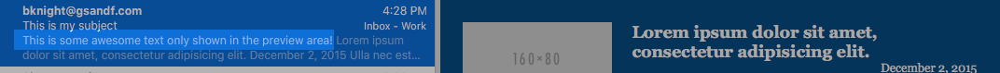
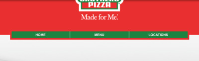
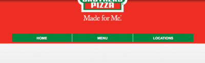

# Email Template Overview
> A guide helping everyone get what is needed from the client, designer, and developer when making an HTML email.

While emails are one of the most [over-]used forms of communication, the technology and standards that make them work is archaic. Making a good email is _nothing_ like making a good web page. This guide is aimed at helping everyone involved in creating emails to be sent to clients/users get the best results possible with the fewest number of surprises possible. This guide is a (non-exhaustive) list of necessary information from the client, realistic expectations from HTML emails, best practices in designing emails, and unanticipated gotchas for developers.


#### Contents:

* [Information for Account Managers and Project Managers](#information-for-account-managers-and-project-managers)
  - [Required Information Before Design and Dev Can Begin](#required-information-before-design-and-dev-can-begin)
  - [Optional Information and Extra Tricks](#optional-information-and-extra-tricks)
* [Design Best Practices](#design-best-practices)
* [Development Tips and Best Practices](#development-tips-and-best-practices)
  - [General tips, tricks, and gotchas](#general-tips-tricks-and-gotchas)
  - [Responsive Emails and Issues for Mobile Clients](#responsive-emails-and-issues-for-mobile-clients)
* [Stuff to Add](#stuff-to-add)


## Information for Account Managers and Project Managers

### Required Information Before Design and Dev Can Begin

* Is this an email template or a one-off email? These will be developed differently, so please let the developer know.
* What is the subject of the email? Please provide this explicitly.
* There will be links in the email. Please provide where the links are expected to go along with the copy.
* Who will be sending the email?
  - If __another firm__ is sending:
    * Who will be hosting the images for the email? If we are, we will need to know - otherwise, no images in the email will show.
    * Who will add the unsubscribe links?
    * What service is the other firm using to send the email? This is not always required, but it **is** required if we are to add an unsubscribe link or if we are delivering a reusable template (as opposed to a one-off email).


### Optional Information and Extra Tricks

It is possible to have text that is shown in the email list preview area, but is hidden in the email itself. The text in the preview area could be a way of generating interest (and email opens) from the end users. It can also get a key idea across in a content-heavy email. If this is desired, please let the dev team know. Remember, this needs to be very short!

#### Example



## Design Best Practices

[According to][cm-max-width-2] [very reputable][cm-max-width] [email creators][mc-basics], emails should be **no more than 600-650 px wide**. While everyone at the agency may have a 5k monitor, a vast majority of email users use a preview pane to read email, which is commonly only ~750-800px wide.

Typography should be limited to [standard system typefaces][mc-typography]. On a website, we can import fonts from e.g. Google, but, sadly, popular email clients such as Gmail, Outlook, and Yahoo! Mail do not support web fonts at all. If the client really wants a particular typeface used, an image of the text *can* be used, but [several email clients][cm-image-blocking] block images by default. It's generally not a good idea to use images to show any key information.

As mentioned in the previous point about typography, images are [blocked by default][cm-image-blocking] on several, popular email clients. It's generally not a good idea to use images to show any key information.

> **NOTE:** remember that anyone with Microsoft Office installed will have the base font set supplied with Office.  While this is nice to take advantage of, it is still recommended to test the design with a standard system font as a fallback.

While your list of fonts is limited, email clients have good support for things such as the line-height (vertial character spacing), letter-spacing (e.g. tracking, e.g. horizontal character spacing), word-spacing, etc. Email client support for margins and general positioning is very poor. Where this has the biggest effect is text and images cannot overlap without putting copy inside "sliced" images.

#### Expected result (Apple Mail)


#### Most email clients (Gmail)


There will be links in emails. Please explicitly tell the dev what is expected to be a clickable link. Also, keep in mind that, unlike a web page, there is almost no control over what looks "clickable" by using hover states. That means that there is no way of making a link darker/lighter when a user hovers over it, and there is little control over what the cursor looks like when hovering over a link.


## Development Tips and Best Practices

What developers need to be aware of greatly overlaps what designers should be aware of. It is recommend you read over the [design best practices](#design-best-practices) section. As a brief recap:

* Emails should be **600-650px wide** due to the size of preview panes.
* Web fonts **cannot** be used due to the [low support from email clients][mc-typography]. Desktop Outlook even defaults to Times New Roman when it sees a web font reference. Use [standard system fonts][mc-typography].
* It's generally not a good idea to use images to show any key information because [several email clients][cm-image-blocking] block images by default.

In addition to the look and feel, differences and bugs in email clients are far worse and prolific than those found in web browsers. The following list is by no means comprehensive, and at best scratches the surface of what you should be aware of.

> **Please keep in mind**: Apple's email clients have by far the best support for almost everything you would normally use when making a webpage. That means testing your results on an iPhone on in Mail isn't the best idea because they will show you what you'd expect to see. Test in Gmail, and, if available, Outlook. If you have a Litmus subscription or something similar, that is by far the best way to test.


### General tips, tricks, and gotchas

**Several** CSS selectors and features are simply not supported on various email clients (e.g. even the element selector - such as `body { }` - is not supported in Outlook.com, Yahoo!, Gmail, or AOL).  In some cases (e.g. Outlook.com), support is getting WORSE (e.g. Outlook.com has recently dropped support for CSS margins and floats).

You can have hidden text that gets shown in the email list preview area, but isn't shown in the email itself.

Supposedly, margins are supported in Gmail, but I have never gotten it them work correctly -  especially negative margins.

Almost all styles should be inlined as several, very popular email clients do not read styles in a style tag. There are several tools for helping you do this, so use whatever works best for you. The exception to this rule would be styles in media queries.

It is possible to have text that is shown in the email list preview area, but is hidden in the email itself. The text in the preview area could be a way of generating interest (and email opens) from the end users. It can also get a key idea across in a content-heavy email. If this is desired, please let the dev team know. Remember, this needs to be very short!

#### Example


### Responsive Emails and Issues for Mobile Clients

> Responsive emails are _possible_, but they require more planning. No popular desktop mail app supports media queries (except Apple Mail), but media queries tend to work well on native mobile email clients. The Gmail and Yahoo! Mail apps do NOT support media queries, but all Apple Mail clients, Android 2.2+ clients, and BlackBerry OS 6+ clients support media queries. Funnily enough, the Windows Phone 7.5 email client was the first Microsoft email client to support media queries, but support was dropped again in Windows Phone 8.

The minimum font size on some devices is 13px, but [you can override this][cm-min-font].

The contents of the `<title>` tag is important, as it shows in some client notifications (e.g. Android 4.4).

Media query styles should not be inlined (how would you do that, anyway??). There is no such thing as "mobile-first" in email development, so make everything work on desktop first, and then add extra styles for mobile devices that support it.


## Stuff to Add

  * you can optionally show content if you are in Outlook:
  ```html
  <!--[if mso]> shown only in Outlook <![endif]-->
  <!--[if !mso]> don't show in Outlook <![endif]-->
  ```

[dev-cerberus-home]: http://tedgoas.github.io/Cerberus
[dev-cerberus-github]: https://github.com/TedGoas/Cerberus
[mc-basics]: http://templates.mailchimp.com/getting-started/html-email-basics/ "MailChimp Designer/Developer Reference"
[mc-typography]: http://templates.mailchimp.com/design/typography/ "MailChimp Typography Reference"
[cm-min-font]: http://www.campaignmonitor.com/blog/how-to/2010/12/save-your-layout-by-overriding-the-minimum-font-size-on-the-iphone-and/
[cm-css]: https://www.campaignmonitor.com/css/
[cm-image-blocking]: https://www.campaignmonitor.com/dev-resources/will-it-work/image-blocking/
[cm-max-width]: https://www.campaignmonitor.com/blog/email-marketing/2005/04/maximum-width-for-html-emails/
[cm-max-width-2]: https://www.campaignmonitor.com/blog/email-marketing/2011/06/how-wide-are-html-email-designs-today/
